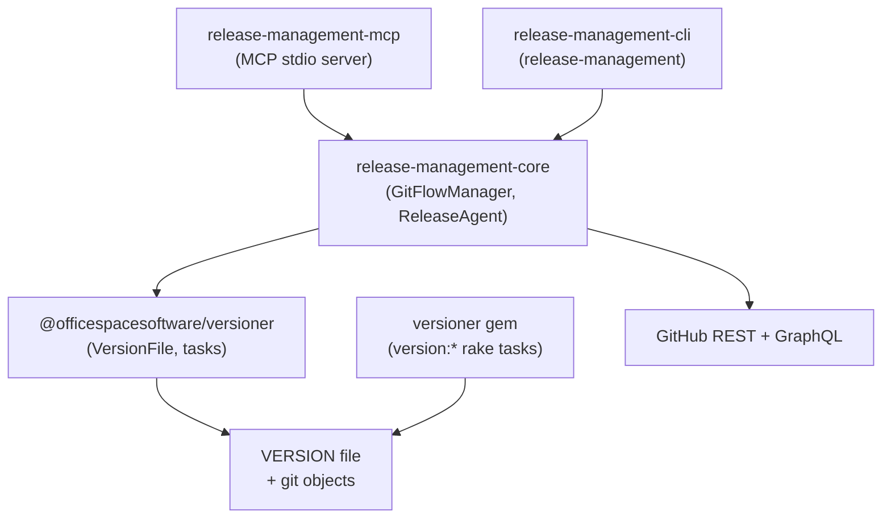
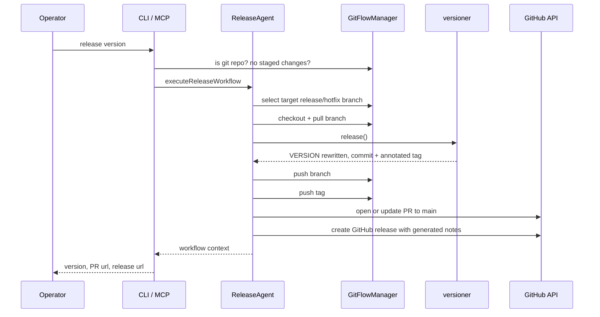

# Architecture

This repository holds two implementations of one versioning contract, plus a release
orchestration stack built on the JavaScript one.

- The **Ruby gem** (`ruby/`) exposes `version:*` Rake tasks.
- The **JavaScript packages** (`js/packages/*`) expose a version CLI/library, a shared
  orchestration core, a plain CLI, and an MCP server.

Both implementations read and write the same two-line `VERSION` file and create the same
git objects, so a project can move between them without migrating anything.

## Components

| Component | Path | Version | Role |
| --- | --- | --- | --- |
| `versioner` (gem) | `ruby/` + `versioner.gemspec` | `1.2.0` (root `VERSION`) | Rake tasks that mutate `VERSION` and create git objects |
| `@officespacesoftware/versioner` | `js/packages/versioner` | `1.0.1` | CLI + library that mutate `VERSION` and create git objects |
| `@officespacesoftware/release-management-core` | `js/packages/release-management-core` | `1.2.0` | Git Flow primitives, workflow orchestration, change plans, GitHub client |
| `@officespacesoftware/release-management-cli` | `js/packages/release-management-cli` | `0.2.0` | Shell/GitHub Actions front-end over the core |
| `@officespacesoftware/release-management-mcp` | `js/packages/release-management-mcp` | `0.4.0` | Model Context Protocol stdio server over the core |

The gem version is read at load time from the first line of the repository-root `VERSION`
file (`ruby/lib/versioner/version.rb`). The JS package versions are the `version` fields of
each `package.json`.

### Registry

`.npmrc` at the repository root maps the scope to GitHub Packages:

```
@officespacesoftware:registry=https://npm.pkg.github.com
```

All four JS packages declare the same `publishConfig`: registry
`https://npm.pkg.github.com`, access `restricted`. The gemspec sets
`allowed_push_host` to `https://github.com`.

## Dependency direction



Dependencies point in one direction only. The core depends on the versioner package; no
package depends on the CLI or the MCP server, and nothing in the core imports `commander`
or the MCP SDK. The Ruby gem and the JS packages share no code — only the `VERSION` file
format and the git object formats.

Both front-ends resolve the core through the workspace protocol
(`"@officespacesoftware/release-management-core": "workspace:^"`), and the core resolves
the versioner package the same way.

## Layers

**Version mutation** lives in `@officespacesoftware/versioner` and the Ruby gem, and
nowhere else.

- `js/packages/versioner/lib/version-file.js` — `VersionFile` class: reads the current
  version, computes the next one, writes it back.
- `js/packages/versioner/lib/version-parser.js` — pure semantic-version arithmetic.
- `js/packages/versioner/lib/file-utils.js` — the only code that writes the `VERSION`
  file on the JS side.
- `js/packages/versioner/lib/git-utils.js` — `gitAdd`, `gitCommit`, `gitTag`.
- `js/packages/versioner/lib/tasks.js` — one exported function per operation; each calls
  the matching `VersionFile` method and then `performGitOperations`, which runs
  `git add VERSION`, `git commit -m "To version <version>"`, and
  `git tag "<version>" -a -m "Release version <version>"`.
- `ruby/lib/versioner/version_file.rb` + `ruby/lib/tasks/versioner.rake` — the Ruby
  equivalents; the rake tasks run the same three git commands.

**Orchestration** lives in `@officespacesoftware/release-management-core`.

- `src/git-flow.ts` — `GitFlowManager`: branch discovery, checkout/fetch/pull/push, merge
  branches, conflict probes, pull requests, GitHub releases, read-only listings.
- `src/release-agent.ts` — `ReleaseAgent`: the multi-step workflows, target-branch
  selection, and plan construction.
- `src/change-plan.ts` — change plans and their digests.
- `src/versioner-adapter.ts` and `src/versioner-direct.ts` — the bridge to the versioner
  package. `VersionerDirectClient` calls the exported task functions in-process,
  `process.chdir`-ing into the target working directory for the duration of each call.
- `src/github-client.ts` — token resolution, `owner`/`repo` parsing, Octokit handles.
- `src/guards.ts` — reusable precondition checks: is a git repository, nothing staged,
  versioner available.

The orchestration layer never writes the `VERSION` file itself. Every version transition
goes through `VersionerAdapter` into the versioner package.

**Front-end presentation** lives in the CLI and MCP packages. Both are thin: they parse
inputs, call core methods, and format results.

- `js/packages/release-management-cli/src/cli.ts` registers subcommands with `commander`;
  `src/commands/*.ts` each wire one workflow; `src/output.ts` emits text or JSON and
  appends `key=value` pairs to `$GITHUB_OUTPUT`; `src/exit-codes.ts` defines exit codes
  `0` success, `1` user error, `2` environment error, `3` partial success.
- `js/packages/release-management-mcp/src/index.ts` declares the tool list and dispatches
  each tool name to a handler that returns a formatted text block. It rebinds its
  `GitFlowManager` and `ReleaseAgent` whenever the requested `workingDirectory` changes.

## The VERSION file contract

The file has exactly two lines:

```
1.2.3-RC.4
36780700aa00
```

1. **Line 1 — the version.** `X.Y.Z` or `X.Y.Z-RC.N`. This is the single source of truth
   for a branch's version; branch names carry no RC suffix, so anything that depends on
   RC state reads this line.
2. **Line 2 — the short git commit hash** captured at write time (`git rev-parse --short
   HEAD`).

Readers take the first line and ignore the rest: `readVersionFile` in
`js/packages/versioner/lib/file-utils.js` splits on `\n` and trims, `VersionFile#version`
in `ruby/lib/versioner/version_file.rb` reads and chomps the first line, and
`GitFlowManager.readBranchVersion` in the core reads `<branch>:VERSION` and keeps the
first line only when it matches `^\d+\.\d+\.\d+`.

Writers are the two mutation layers, and they differ in one byte:

| Writer | Output |
| --- | --- |
| `writeVersionFile` (JS) | `` `${version}\n${gitHash}\n` `` — trailing newline after the hash |
| `VersionFile#write` (Ruby) | `puts(version)` then `print(revision)` — no trailing newline after the hash |

Both forms parse identically in both implementations, because every reader trims. The JS
`createVersionFile` and the Ruby `create_file` both refuse to overwrite an existing
`VERSION` file.

The file path is configurable and defaults to `VERSION`:
`Versioner.options[:version_file_path]` in Ruby, `setOption('version_file_path', …)` in
the JS `options` module.

## GitHub token resolution order

`createGitHubClient` in `js/packages/release-management-core/src/github-client.ts` resolves
a token in this order and uses the first non-empty result:

1. `GH_TOKEN` environment variable
2. `GITHUB_TOKEN` environment variable
3. the output of `gh auth token`
4. `~/.config/gh/hosts.yml` → `github.com.oauth_token`

When none of the four yields a token, client creation fails with a message naming
`GH_TOKEN`, `GITHUB_TOKEN`, and `gh auth login`.

`owner` and `repo` come from `git remote get-url origin`, parsed from either
`git@github.com:owner/repo(.git)` or `https://github.com/owner/repo(.git)`. Any other
form is an error. Clients are cached per working directory; `clearGitHubClientCache`
drops one entry or all of them.

## A representative end-to-end flow

Promoting a release candidate to a final version, as `release_version` (MCP) or
`release-management release-version` (CLI):



`docs/actions.md` records the ordered steps and the exact git objects for every action.

## Build and test topology

`js/package.json` is a private pnpm workspace (`versioner-js-workspace`) whose
`pnpm-workspace.yaml` includes `packages/*`. Its scripts fan out with `pnpm -r`:
`build`, `test`, `typecheck` (which runs `pnpm -r build`), `clean`, `dev`, and `release`
(`node scripts/release.mjs`).

| Package | `build` | `test` | `dev` | `clean` |
| --- | --- | --- | --- | --- |
| `versioner` | echo placeholder (pure JS) | `node --test test/*.test.js` | `dev:test` (watch mode) | — |
| `release-management-core` | `tsc` | `node --test test/*.test.mjs` (after `pretest: tsc`) | `tsc --watch` | `rm -rf lib/` |
| `release-management-cli` | `tsc` | — | `tsc --watch` | `rm -rf lib/` |
| `release-management-mcp` | `tsc` | — | `tsc --watch` | `rm -rf lib/` |

TypeScript packages compile `src/` to `lib/` with declarations, extending
`js/tsconfig.base.json` (ES2022, `strict`, `noUncheckedIndexedAccess`,
`exactOptionalPropertyTypes`). The versioner package is plain ESM JavaScript with no
compile step.

The Ruby gem is tested with RSpec from `ruby/` (`bundle exec rspec`, or `bundle exec rake`
for the default task) and linted with `bundle exec rubocop`. `.tool-versions` pins
Ruby `4.0.5`.
